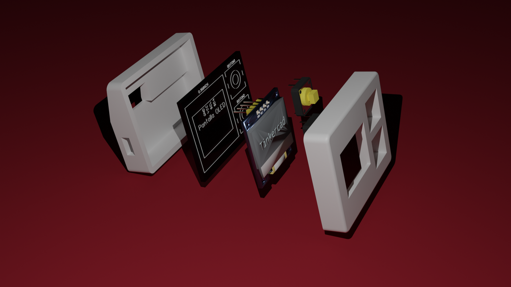
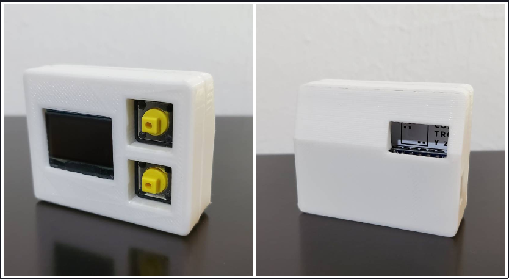
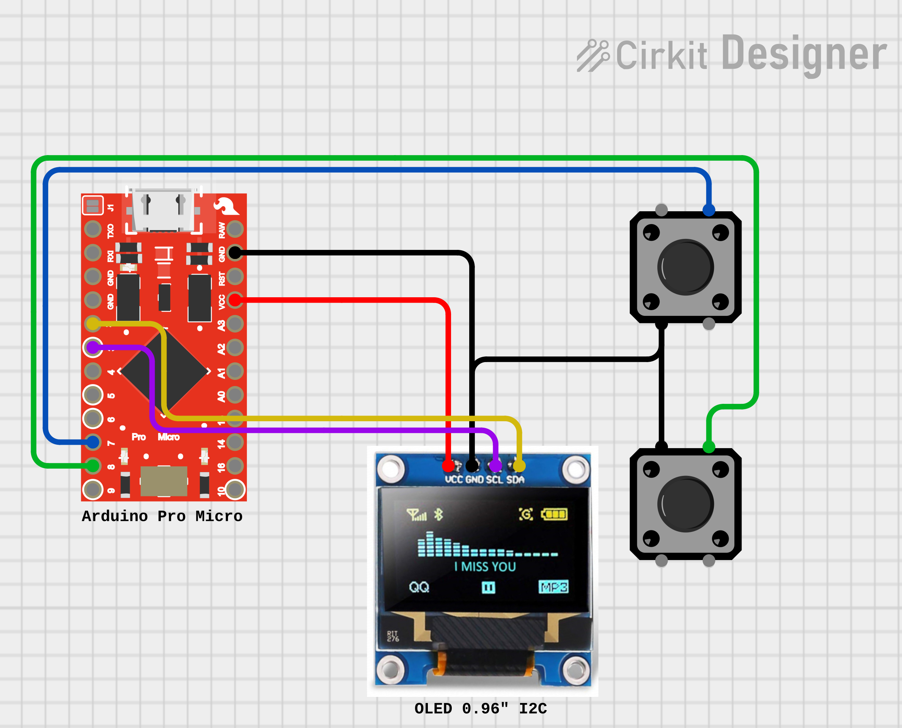

# Doai



## Introduction
Doai is a simple PCB yet powerful device. It can be used as a RubberDucky, TOTP device, or an info retriever. All required files are available: `3D printing`, `PCB`, `codes`.



***
## Installation
```bash
git clone https://github.com/alvaro-cas/doai
cd ./doai
```

### Select desired code
- [TOTP](https://github.com/alvaro-cas/doai/tree/main/examples/totp) (Any OS - Python)

- [Info Retriever](https://github.com/alvaro-cas/doai/tree/main/examples/infoRetriever) (Linux)

- [RubberDucky](https://github.com/alvaro-cas/doai/tree/main/examples/rubberducky) (Any OS)

***

> Check further instructions inside each project folder.

***

## Part List
- [Buttons 12x12](https://amzn.to/3L2oZz4)
- [OLED Screen 128x64 0.96"](https://amzn.to/41Lxp4Q)
- [PCB](https://github.com/alvaro-cas/doai/tree/main/pcb)
- [3D Model](https://github.com/alvaro-cas/doai/tree/main/3d)

***

## Circuit Diagram


***

## MIT LICENSE
Review the [LICENSE](https://github.com/alvaro-cas/doai/blob/main/LICENSE)

***
## The End
I hope you enjoy! You can *support* my work [here](https://liberapay.com/Cuatroy2/donate) (I contribute 1% of my revenue to fund carbon removal🌳) or check more content at my [GitHub](https://github.com/alvaro-cas), [YouTube (Spanish)](https://www.youtube.com/@cuatroy2) or [Medium](https://medium.com/@cuatroy2). Happy Day! 😃

<noscript><a href="https://liberapay.com/Cuatroy2/donate"></a></noscript>
