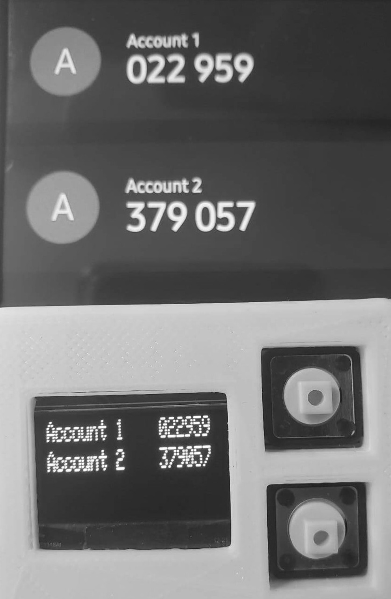

# TOTP

## Preview


***

## Installation

1. Open `totp.ino` and change **keys** ([HEX](https://cryptii.com/pipes/base32-to-hex)), **keyNames** and **keyLength** to desired.

***

2. [Upload](https://docs.arduino.cc/software/ide-v1/tutorials/Environment#uploading) `totp.ino` to Arduino.

***

3. Open `timer.py` and change [port](https://support.arduino.cc/hc/en-us/articles/4406856349970-Select-board-and-port-in-Arduino-IDE) (current /dev/ttyACM0)

***

2. Navigate to current folder `/examples/totp`
```bash
pip install pyserial
python timer.py
```

***

5. Use!

***

